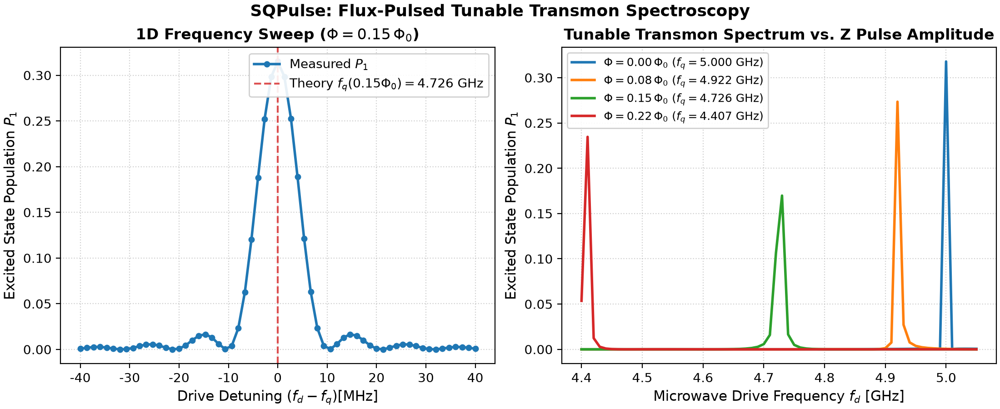

<p align="center">
  
</p>

# SQPulse: 超导量子比特动力学仿真

**SQPulse** 是一个专为超导量子计算（Transmon Qubit）、微波脉冲工程与含时量子动力学模拟而设计的现代 Python 库，提供了直观、模块化和显式调用的 API。

---

## 物理量单位约定 (SI Units)

本项目中所有物理量均严格遵循国际单位制。

> [!TIP]
> **推荐使用内置物理单位常量**：
> SQPulse 提供了清晰易读的单位常量，可直接导入乘用，彻底避免将纳秒误写为秒：
> ```python
> from sqpulse import ns, us, ms, Hz, MHz, GHz
> 
> # 40 ns 脉冲，平顶过渡 8 ns
> p = FlatTopPulse(duration=40 * ns, ramp_time=8 * ns)
> ```

---

## 核心特性

1. **丰富的脉冲波形与时频域双重视角**：
   - 支持高斯脉冲 (`GaussianPulse`)、升余弦脉冲 (`CosinePulse` / Hann 窗)、柯西-洛伦兹脉冲 (`LorentzianPulse`)、理想方波 (`SquarePulse`)、平顶平滑脉冲 (`FlatTopPulse`)、双曲正割脉冲 (`SechPulse`)、DRAG 导数修正脉冲 (`DRAGPulse`) 及任意自定义波形 (`CustomPulse`)。
   - 提供同名小写函数式快捷工厂（如 `gaussian_pulse(...)`, `flattop_pulse(...)`），并支持 `length` 作为 `duration` 的参数别名。
   - 内置智能自适应高分辨率采样，一键式时频双域可视化 (`pulse.plot(domain="both")`)，轻松分析脉冲频谱、半高全宽（FWHM）、谱泄露（Spectral Leakage）与旁瓣衰减。
   - 内置严格的物理量纲与采样步长防错校验，拦截常见的采样步长/参数时间尺度混淆并给出智能修复建议。

2. **严谨的受驱动 Transmon 物理模型**：
   - 支持多能级截断 ($d \ge 2$)，准确刻画更高能级态 $|2\rangle$ 的弱跃迁与泄露。
   - 包含量子频率 $f_q$、非谐性 $\alpha$、微波驱动正交算符 $H_x, H_y$。
   - 内置包含能量弛豫 $T_1$、纯退相位 $T_\phi$（根据 $T_2$ 换算）与热激发 $n_{\text{th}}$ 的完整 Lindblad 耗散主方程。

3. **显式的时间轴脉冲编排调度器 (`PulseSequence`)**：
   - 无隐式全局副作用，通过链式或方法调用清晰添加脉冲 (`add`)、插入延时 (`delay`) 与多通道时钟同步 (`sync`)。
   - 一键绘制多通道时序图 (`seq.plot()`)，并可直接编译为 QuTiP 5 的 `QobjEvo` 含时哈密顿量。

4. **动力学主方程演化与量子态分析 (`Simulator`)**：
   - 基于现代 QuTiP 5 求解器快速求解密度矩阵或纯态演化。
   - 提供各能级粒子数布居随时间演化曲线 (`plot_populations`)、Bloch 坐标曲线 (`plot_bloch_vector`) 及 3D Bloch 球轨迹投影 (`plot_bloch_sphere`)。

5. **标准化经典量子实验协议 (`experiments`)**：
   - **Amplitude / Time Rabi**：自动扫描驱动幅度（$\text{rad/s}$），通过正弦拟合标定 $\pi$ 脉冲与 $\pi/2$ 脉冲。
   - **$T_1$ 弛豫测量**：施加 $\pi$ 脉冲后扫描延时，通过指数衰减拟合提取 $T_1$ 寿命。
   - **Ramsey 干涉测量**：$\pi/2 - \tau - \pi/2$ 干涉序列，通过阻尼正弦拟合提取 $T_2^*$ 及微波失谐量 $\Delta$。
   - **Qubit / Power 频谱测量**：扫描微波驱动频率自动探测单光子与双光子激发谱，精确提取 $f_{01}$、非谐性 $\alpha$ 与两能级粒子数响应。

---

## Transmon 物理建模与数学公式

SQPulse 中的 `Transmon` 模型以经典 circuit QED 为基础，严格采用国际单位制（SI units）。其完整物理模型与计算公式如下：

### 1. 静态哈密顿量（旋转坐标系）

在载波参考频率为 $f_d$（$\text{Hz}$）的旋转坐标系下，经过旋转波近似（RWA）后，多能级 Transmon 的静态哈密顿量为 Duffing / Kerr 非线性模型：

$$H_0 = 2\pi (f_q - f_d) a^\dagger a + \pi \alpha a^{\dagger 2} a^2 \quad (\text{rad/s})$$

* $f_q$：Qubit $0 \leftrightarrow 1$ 跃迁频率（单位：$\text{Hz}$，例如 $5.0 \times 10^9\text{ Hz}$）。
* $\Delta = f_q - f_d$：驱动失谐量（单位：$\text{Hz}$）。在共振驱动参考系下（默认 $f_d = f_q$），失谐项为零。
* $\alpha$：非谐性（Anharmonicity，单位：$\text{Hz}$，通常为负值，如 $-250 \times 10^6\text{ Hz}$）。
* $a, a^\dagger$：湮灭算符与产生算符，维度由截断能级 `levels` 决定（默认 `levels=4`）。
* 对 Fock 态 $|n\rangle$，本征能量为：$E_n = 2\pi (f_q - f_d) n + \pi \alpha n(n-1)$。由此可知相邻能级跃迁频率差为：
  * $\omega_{01} = 2\pi (f_q - f_d)$
  * $\omega_{12} = \omega_{01} + 2\pi \alpha$（两能级差相差 $2\pi \alpha$）。

### 2. SQUID 磁通调频与引线体系（Flux Tuning & Control Lines）

SQPulse 的 `Transmon` 统一兼容单结与对称/非对称 SQUID 模型。通过结不对称度参数 $d \in [0.0, 1.0]$（默认 $d=1.0$ 为单结）：
$$E_J(\Phi) = E_{J,\Sigma} \sqrt{\cos^2\left(\pi \frac{\Phi}{\Phi_0}\right) + d^2 \sin^2\left(\pi \frac{\Phi}{\Phi_0}\right)}$$
$$f_q(\Phi) = (f_q + |\alpha|) \left[ \cos^2\left(\pi \frac{\Phi}{\Phi_0}\right) + d^2 \sin^2\left(\pi \frac{\Phi}{\Phi_0}\right) \right]^{1/4} - |\alpha|$$

* $d = 1.0$ 时，$\cos^2 + \sin^2 = 1$，$f_q(\Phi) \equiv f_q$ 恒定不变，退化为单结 Transmon；
* $d < 1.0$ 时，可通过外加磁通 $\Phi/\Phi_0$ 动态调谐比特频率。

每个 Transmon 对象提供三条专职物理引线（Channel）：
* **`q.xy`**：电容耦合线，注入微波正交脉冲 $I(t), Q(t)$，驱动 Bloch 球水平轴旋转。
* **`q.z`**：互感耦合线，注入纳秒级基带磁通偏置脉冲，动态改变跃迁频率 $f_q(t)$。支持通过 `v_phi0`（$V_{\Phi_0}$，单位 $\text{V}/\Phi_0$）将 AWG 输出物理电压自动折算为超导环净磁通 $\Phi/\Phi_0 = V / V_{\Phi_0}$。
* **`q.ro`**：读出微波馈线，连接微波谐振腔（Readout Resonator）。

### 3. 微波驱动哈密顿量（RWA 下）

微波驱动信号由 AWG 产生的同相基带包络 $I(t)$ 和正交基带包络 $Q(t)$ 调制，在旋转坐标系下的含时驱动哈密顿量为：

$$H_d(t) = \frac{1}{2} \Omega_d \Big[ I(t) (a + a^\dagger) + Q(t) i(a^\dagger - a) \Big] = I(t) H_{\text{drive},x} + Q(t) H_{\text{drive},y} \quad (\text{rad/s})$$

其中：
* $H_{\text{drive},x} = \frac{1}{2} \Omega_d (a + a^\dagger)$：对应 Bloch 球上的绕 $X$ 轴驱动算符。
* $H_{\text{drive},y} = \frac{1}{2} \Omega_d i(a^\dagger - a)$：对应 Bloch 球上的绕 $Y$ 轴驱动算符。
* $\Omega_d$ (`omega_d`)：物理驱动耦合强度（单位：$\text{rad/s}$，默认 $2\pi \times 50\text{ MHz} \approx 3.14 \times 10^8\text{ rad/s}$）。
* $I(t), Q(t)$：脉冲序列输出的归一化 AWG 电压信号（无量纲，标称范围 $[-1, 1]$）。

系统总哈密顿量即为：
$$H(t) = H_0(t) + I(t) H_{\text{drive},x} + Q(t) H_{\text{drive},y}$$

### 4. 谐振腔色散读出物理原理 (`ReadoutResonator` & `DispersiveReadoutBackend`)

在电路 QED 色散区（$|\Delta_{qr}| \gg g$），微波谐振腔频率随 Transmon 状态产生色散频移 $\chi$：
$$f_r^{(0)} = f_r - \chi / (2\pi), \quad f_r^{(1)} = f_r + \chi / (2\pi)$$

1. **稳态透射谱 ($S_{21}$)**：
   $$S_{21}(f; |n\rangle) = \frac{\kappa_{\text{ext}}}{i 2\pi (f - f_r^{(n)}) + \kappa / 2}$$
2. **含时光子建立与衰减（Langevin 方程）**：
   $$\frac{d\alpha_n(t)}{dt} = - \left[ i 2\pi (f_{\text{ro}} - f_r^{(n)}) + \frac{\kappa}{2} \right] \alpha_n(t) - i \epsilon_{\text{scale}} \epsilon(t)$$
3. **数字解调与单次判决（IQ 复平面）**：
   $$S = I + i Q = \frac{1}{T_{\text{meas}}} \int_0^{T_{\text{meas}}} \sqrt{\kappa_{\text{ext}}} \alpha(t) dt + \xi_{\text{noise}}$$
   通过 `IQDiscriminator` 线性阈值判决，输出真实的混淆矩阵与读出保真度 $\mathcal{F}_{\text{ro}} = \frac{P(0|0) + P(1|1)}{2}$。

### 5. 电路物理参数推导驱动与磁通耦合强度 (`Transmon.from_circuit`)

在超导量子芯片中，微波驱动耦合强度 $\Omega_d$ 和 Z 线磁通周期电压 $V_{\Phi_0}$ 均可由芯片版图电容/互感参数、微波线路衰减及 AWG 输出电压直接解析推导（参考 Krantz et al., 2019）：

#### A. XY 微波电容驱动耦合率 ($\Omega_d$)
1. **总有效电容**：
   $$C_\Sigma = C_g + C_d$$
   （$C_g$ 为对地并联电容，$C_d$ 为微波驱动线对量子比特的耦合电容）
2. **零点电荷涨落（Zero-point charge fluctuation）**：
   $$Q_{\text{zpf}} = \sqrt{\frac{\hbar \omega_q C_\Sigma}{2}}, \quad \omega_q = 2\pi f_q$$
3. **芯片端单位驱动电压耦合率（On-chip coupling rate）**：
   $$\Omega_{\text{chip}} = \frac{C_d}{C_\Sigma} \frac{Q_{\text{zpf}}}{\hbar} \quad \left[\frac{\text{rad}}{\text{s}\cdot\text{V}}\right]$$
4. **微波线路总衰减因子**：
   $$\alpha_{\text{line}} = 10^{\text{attenuation\_dB} / 20}$$
5. **有效物理驱动耦合强度**：
   $$\Omega_d = \Omega_{\text{chip}} \cdot \alpha_{\text{line}} \cdot V_{\text{max}} \quad (\text{rad/s})$$

#### B. Z 偏置线互感与磁通周期电压 ($V_{\Phi_0}$)
对于 Z 偏置线与 SQUID 超导环的几何互感耦合：
1. **Z 偏置线路衰减**：
   $$\alpha_{\text{line}, z} = 10^{\text{attenuation\_z\_dB} / 20}$$
2. **芯片短路端动态电流**：
   $$I_{\text{chip}} = \frac{V_{\text{AWG}} \cdot \alpha_{\text{line}, z}}{Z_0} \quad (Z_0 = 50\,\Omega)$$
3. **SQUID 环感应磁通**：
   $$\Phi = M \cdot I_{\text{chip}} = \frac{M \cdot \alpha_{\text{line}, z}}{Z_0} V_{\text{AWG}}$$
4. **有效磁通周期电压（Flux Period Voltage）**：
   $$V_{\Phi_0} = \frac{\Phi_0 Z_0}{M \cdot \alpha_{\text{line}, z}} \quad [\mathrm{V}/\Phi_0]$$
   （其中 $\Phi_0 = h / (2e) \approx 2.0678 \times 10^{-15}\ \mathrm{Wb}$，使穿过 SQUID 环净磁通改变 $1.0\,\Phi_0$ 所需的 AWG 输出峰值电压）

### 6. 开放系统 Lindblad 耗散主方程

考虑退相干效应时，系统密度矩阵 $\rho(t)$ 的动力学演化满足 Lindblad 主方程：

$$\frac{d\rho}{dt} = -i [H(t), \rho] + \sum_k \mathcal{D}[L_k]\rho$$

其中 Lindblad 超算符定义为：
$$\mathcal{D}[L]\rho = L \rho L^\dagger - \frac{1}{2} \big\{ L^\dagger L, \rho \big\}$$

模型包含的三个主要耗散通道及其坍缩算符（Collapse Operators）$L_k$：
* **能量弛豫（$T_1$ 衰减）**：
  $$L_{\text{down}} = \sqrt{\frac{1 + n_{\text{th}}}{T_1}} a$$
* **热平衡激发（$n_{\text{th}}$）**：
  $$L_{\text{up}} = \sqrt{\frac{n_{\text{th}}}{T_1}} a^\dagger$$
* **纯退相位（Pure Dephasing，$T_\phi$）**：
  根据横向弛豫时间 $T_2$ 满足的物理关系 $\frac{1}{T_2} = \frac{1}{2 T_1} + \frac{1}{T_\phi}$，换算得到纯退相位速率：
  $$\Gamma_\phi = \frac{1}{T_2} - \frac{1}{2 T_1}$$
  纯退相位坍缩算符为：
  $$L_\phi = \sqrt{2 \Gamma_\phi} a^\dagger a = \sqrt{2 \left(\frac{1}{T_2} - \frac{1}{2 T_1}\right)} \hat{n}$$

---

## 快速上手

### 1. 查看脉冲时域与频域特征

```python
import matplotlib.pyplot as plt
from sqpulse import GaussianPulse, CosinePulse, SquarePulse, FlatTopPulse, DRAGPulse, compare_pulses, ns, MHz

# 定义一个 40 ns 的高斯脉冲 (支持 40e-9 或 40 * ns，支持 length 或 duration)
p_gauss = GaussianPulse(duration=40 * ns, amp=1.0, chop=4.0)

# 定义一个平顶脉冲 (40 ns 总时长，8 ns 平滑过渡边沿)
p_flattop = FlatTopPulse(duration=40 * ns, ramp_time=8 * ns, ramp_type="cosine")

# 定义带有无量纲 DRAG 修正的脉冲 (drag=1.0 为理论最优一阶修正)
p_drag = DRAGPulse(duration=20 * ns, amp=1.0, drag=1.0)

# 一键展示时域波形与频域 FFT 功率谱（无需手动计算 dt，内置自适应高分辨率采样）
p_drag.plot(domain="both")
plt.show()

# 对比多种波形的抗高频谱泄露性能 (cutoff = 100 MHz = 100 * MHz)
p_cos = CosinePulse(duration=40 * ns, amp=1.0)
p_sq = SquarePulse(duration=40 * ns, amp=1.0)
compare_pulses([p_gauss, p_cos, p_sq], domain="both")
plt.show()
```

### 2. 定义受驱动 Transmon 并编排多通道脉冲序列

```python
import matplotlib.pyplot as plt
from sqpulse import Transmon, ReadoutResonator, PulseSequence, GaussianPulse, FlatTopPulse, Measurement, ns, us, MHz, GHz

# 1. 定义通用 Transmon (支持结不对称度 d; d=1.0 为单结, d=0.2 为可调 SQUID)
q = Transmon("q0", f_q=5.0 * GHz, alpha=-250.0 * MHz, d=0.2, levels=3, t1=25.0 * us, t2=18.0 * us)

# 2. 编排多通道脉冲序列 (包含 XY 驱动、Z 磁通调频与腔读出)
seq = PulseSequence(name="control_and_readout")
# (1) 在 xy (XY) 施加 pi/2 脉冲
seq.add(q.xy, GaussianPulse(duration=30 * ns, amp=0.5))
seq.sync()

# (2) 在 z (Z) 施加快速磁通脉冲调制频率
seq.add(q.z, FlatTopPulse(duration=40 * ns, amp=0.1, ramp_time=4 * ns))
seq.sync()

# (3) 施加第二个 pi/2 脉冲
seq.add(q.xy, GaussianPulse(duration=30 * ns, amp=0.5))
seq.sync()

# (4) 在 ro (RO) 施加 1 us 微波读出脉冲
seq.add(q.ro, FlatTopPulse(duration=1000 * ns, amp=1.0, ramp_time=20 * ns))

# 绘制多通道时间轴对齐图
seq.plot()
plt.show()

# 3. 双后端测量选择
# 方式 A：选择理想投影与态演化后端 (精确主方程求解)
res_proj = Measurement.run(q, seq, backend="projective")
res_proj.plot_populations()
plt.show()

# 方式 B：选择真实色散谐振腔读出后端 (微波传输谱、IQ 解调与单次判决)
cavity = ReadoutResonator(name="r0", f_r=7.0 * GHz, kappa=2.0 * np.pi * 3.0 * MHz, chi=2.0 * np.pi * 1.5 * MHz)
res_disp = Measurement.run(q, seq, backend="dispersive", resonator=cavity, shots=1000, snr_db=15.0)
res_disp.plot_iq_plane()     # 查看 IQ 平面聚类散点图与判决面
res_disp.plot_trajectories() # 查看腔内光子动力学建立与衰减
plt.show()
print(f"读出保真度: {res_disp.fidelity:.2%}")
print("混淆矩阵:\n", res_disp.confusion_matrix)
```

### 3. 运行量子实验测量

```python
import matplotlib.pyplot as plt
from sqpulse import Transmon, GaussianPulse, RabiExperiment, T1Experiment, RamseyExperiment

q = Transmon("q0", f_q=5.0e9, alpha=-250.0e6, t1=20.0e-6, t2=15.0e-6)

# 3.1 振幅 Rabi 标定 pi 脉冲 AWG 输出幅度 V_0
rabi_res = RabiExperiment.amplitude_rabi(q, pulse_type=GaussianPulse, duration=40e-9)
print(f"标定得到的 pi 脉冲幅度 V_0: {rabi_res.amp_pi:.3f}")
rabi_res.plot()
plt.show()

# 3.2 T1 弛豫测量
pi_pulse = GaussianPulse(duration=40e-9, amp=rabi_res.amp_pi)
t1_res = T1Experiment.run(q, pi_pulse=pi_pulse)
print(f"拟合得到的 T1 寿命: {t1_res.t1_fit:.2e} s")
t1_res.plot()
plt.show()

# 3.3 Ramsey 干涉实验 (失谐 detuning = 2 MHz = 2e6 Hz)
pi2_pulse = GaussianPulse(duration=40e-9, amp=rabi_res.amp_pi_half)
ramsey_res = RamseyExperiment.run(q, pi_half_pulse=pi2_pulse, detuning=2.0e6)
print(f"拟合测得 T2*: {ramsey_res.t2_star:.2e} s, 失谐: {ramsey_res.fitted_detuning:.2e} Hz")
ramsey_res.plot()
plt.show()
```

### 4. Z 脉冲改变磁通并扫描 XY 驱动频率测量可调 Transmon 频谱 (Flux-Pulsed Spectroscopy)

在超导量子计算实验中，**磁通可调 Transmon（SQUID Transmon）** 的能级跃迁频率由穿过超导环的磁通量 $\Phi$ 决定。实验中通常将比特停驻在对低频磁通噪声一阶不敏感的对称点（Sweet Spot，$\Phi=0$）。

在执行调频交互或频率多路复用时，通过 **Z 偏置引线 (`q.z`)** 注入纳秒级基带平顶磁通脉冲，可将比特快速移频至目标工作点；在 Z 脉冲平顶稳定期间，于 **XY 控制引线 (`q.xy`)** 注入微弱的长微波探测脉冲并扫描载波驱动频率 $f_d$。当 $f_d$ 命中该偏置磁通下的比特固有频率 $f_q(\Phi)$ 时发生共振吸收跃迁，从而高精度测出移动后的量子比特能谱响应。

<p align="center">
  
</p>

```python
import numpy as np
import matplotlib.pyplot as plt
from sqpulse import Transmon, PulseSequence, FlatTopPulse, Simulator, ns, us, MHz, GHz

# 1. 定义可调 SQUID Transmon (结不对称度 d=0.25 < 1.0)
q = Transmon(
    name="q0",
    f_q=5.0 * GHz,        # 对称点 (Sweet Spot, Phi=0) 跃迁频率
    alpha=-250.0 * MHz,   # 非谐性
    d=0.25,               # 结不对称度 (d < 1.0 为磁通可调 Transmon)
    levels=3,             # 截断能级 (|0>, |1>, |2>)
    t1=30.0 * us,
    t2=20.0 * us,
)

print(f"Sweet Spot 静态频率 f_q(0): {q.frequency_at_flux(0.0) / 1e9:.3f} GHz")

# 注：若设置物理电压转换参数 v_phi0=0.8 (或使用 Transmon.from_circuit(m_mutual=2.5e-12, attenuation_z_dB=-20.0))，
# Z 脉冲 amp 可直接填入仪器真实输出电压 (V)，底层将自动换算：Delta_Phi = amp / v_phi0。
# 未设置 v_phi0 时，amp 默认直接对应无量纲磁通量 Phi / Phi_0。

# 2. 构造多通道联合脉冲时序：Z 偏置脉冲 + 同步 XY 微波弱探测脉冲
phi_bias = 0.15                           # 目标 Z 偏置幅度 (单位: Phi_0)
f_shifted = q.frequency_at_flux(phi_bias) # 理论移动后跃迁频率 ~4.726 GHz

# (1) 在 Z 偏置线施加 120 ns 平顶磁通脉冲 (上升/下降沿各 10 ns)
z_pulse = FlatTopPulse(duration=120 * ns, amp=phi_bias, ramp_time=10 * ns)

# (2) 在 XY 控制线施加 100 ns 弱微波探测脉冲 (延时 10 ns 对齐至 Z 脉冲平顶稳定阶段)
xy_probe = FlatTopPulse(duration=100 * ns, amp=0.04, ramp_time=5 * ns)

seq = PulseSequence(name="flux_qubit_spec")
seq.add(q.z, z_pulse)
seq.delay(q.xy, 10 * ns)
seq.add(q.xy, xy_probe)

# 3. 扫描 XY 驱动载波频率 f_d
freqs = np.linspace(f_shifted - 40 * MHz, f_shifted + 40 * MHz, 61)
p1_vals = []

for fd in freqs:
    # 模拟驱动载波频率为 fd 时的含时哈密顿量动力学演化
    res = Simulator.run(q, seq, dt=1.0 * ns, f_d=float(fd))
    p1_vals.append(res.final_population(1))

p1_vals = np.array(p1_vals)
f_peak = freqs[np.argmax(p1_vals)]

print(f"理论目标跃迁频率: {f_shifted / 1e9:.4f} GHz")
print(f"微波扫描共振峰值: {f_peak / 1e9:.4f} GHz (峰值激发态布居 P1 = {np.max(p1_vals):.3f})")

# 4. 绘制 1D 频谱响应
plt.figure(figsize=(6.5, 4))
plt.plot((freqs - f_shifted) / 1e6, p1_vals, "o-", color="#1f77b4", lw=2, ms=4, label="Measured $P_1$")
plt.axvline(0, color="#d62728", linestyle="--", label=rf"Theoretical $f_q({phi_bias}\Phi_0)$")
plt.xlabel(r"Drive Detuning $(f_d - f_q)\ [\mathrm{MHz}]$")
plt.ylabel(r"Excited State Population $P_1$")
plt.title(rf"Flux-Pulsed Spectroscopy ($\Phi = {phi_bias}\,\Phi_0$)")
plt.grid(True, linestyle=":", alpha=0.6)
plt.legend()
plt.tight_layout()
plt.show()

# 5. 进阶：扫描不同 Z 脉冲偏置幅度，标定完整的磁通调频谱 (Flux Arc)
flux_biases = [0.0, 0.08, 0.15, 0.22]
f_grid = np.linspace(4.4 * GHz, 5.05 * GHz, 66)

plt.figure(figsize=(7.5, 4))
for phi in flux_biases:
    s = PulseSequence()
    s.add(q.z, FlatTopPulse(duration=120 * ns, amp=phi, ramp_time=10 * ns))
    s.delay(q.xy, 10 * ns)
    s.add(q.xy, FlatTopPulse(duration=100 * ns, amp=0.04, ramp_time=5 * ns))
    p1_trace = [Simulator.run(q, s, dt=1.5 * ns, f_d=float(fd)).final_population(1) for fd in f_grid]
    f_th = q.frequency_at_flux(phi)
    plt.plot(f_grid / 1e9, p1_trace, lw=2, label=rf"$\Phi = {phi:.2f}\,\Phi_0\ (f_q={f_th/1e9:.3f}\ \mathrm{{GHz}})$")

plt.xlabel(r"Microwave Drive Frequency $f_d\ [\mathrm{GHz}]$")
plt.ylabel(r"Excited State Population $P_1$")
plt.title("Tunable Transmon Spectrum vs. Z Pulse Amplitude")
plt.grid(True, linestyle=":", alpha=0.6)
plt.legend()
plt.tight_layout()
plt.show()
```

---

## 运行测试

使用 `pytest` 运行单元测试套件：

```bash
uv run pytest
```
