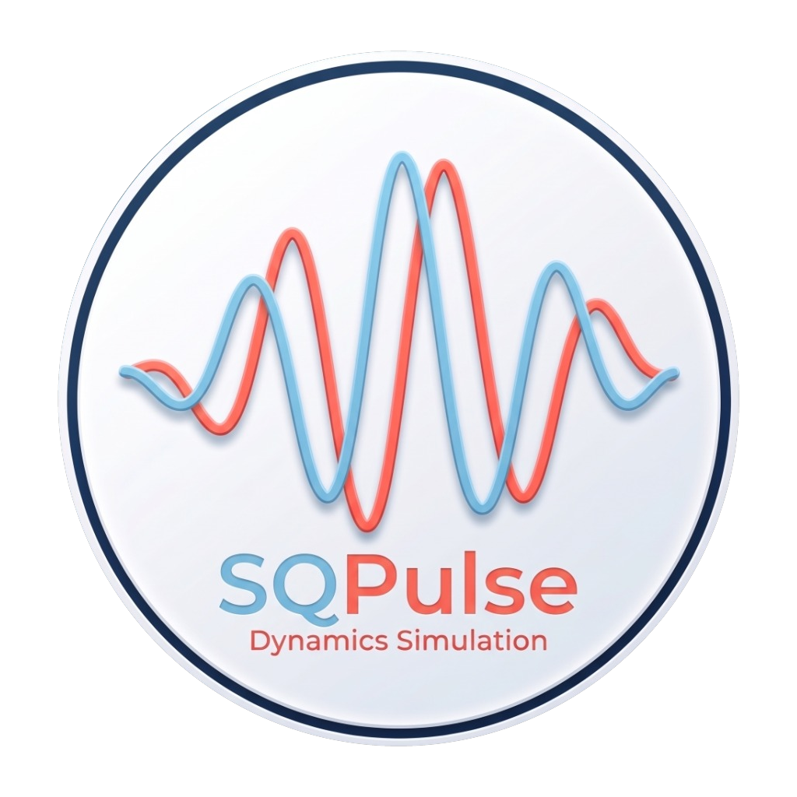

<p align="center">
  
</p>

# SQPulse: 超导量子比特动力学仿真

**SQPulse** 是一个专为超导量子计算（Transmon Qubit）、微波脉冲工程与含时量子动力学模拟而设计的现代 Python 库，提供了直观、模块化和显式调用的 API。

---

## 物理量单位约定 (SI Units)

本项目中所有物理量均严格遵循国际单位制。

> [!TIP]
> **推荐使用内置物理单位常量**：
> SQPulse 提供了清晰易读的单位常量，可直接导入乘用，彻底避免将纳秒误写为秒：
> ```python
> from sqpulse import ns, us, ms, Hz, MHz, GHz
> 
> # 40 ns 脉冲，平顶过渡 8 ns
> p = FlatTopPulse(duration=40 * ns, ramp_time=8 * ns)
> ```

---

## 核心特性

1. **丰富的脉冲波形与时频域双重视角**：
   - 支持高斯脉冲 (`GaussianPulse`)、升余弦脉冲 (`CosinePulse` / Hann 窗)、柯西-洛伦兹脉冲 (`LorentzianPulse`)、理想方波 (`SquarePulse`)、平顶平滑脉冲 (`FlatTopPulse`)、双曲正割脉冲 (`SechPulse`)、DRAG 导数修正脉冲 (`DRAGPulse`) 及任意自定义波形 (`CustomPulse`)。
   - 提供同名小写函数式快捷工厂（如 `gaussian_pulse(...)`, `flattop_pulse(...)`），并支持 `length` 作为 `duration` 的参数别名。
   - 内置智能自适应高分辨率采样，一键式时频双域可视化 (`pulse.plot(domain="both")`)，轻松分析脉冲频谱、半高全宽（FWHM）、谱泄露（Spectral Leakage）与旁瓣衰减。
   - 内置严格的物理量纲与采样步长防错校验，拦截常见的采样步长/参数时间尺度混淆并给出智能修复建议。

2. **严谨的受驱动 Transmon 物理模型**：
   - 支持多能级截断 ($d \ge 2$)，准确刻画更高能级态 $|2\rangle$ 的弱跃迁与泄露。
   - 包含量子频率 $f_q$、非谐性 $\alpha$、微波驱动正交算符 $H_x, H_y$。
   - 内置包含能量弛豫 $T_1$、纯退相位 $T_\phi$（根据 $T_2$ 换算）与热激发 $n_{\text{th}}$ 的完整 Lindblad 耗散主方程。

3. **显式的时间轴脉冲编排调度器 (`PulseSequence`)**：
   - 无隐式全局副作用，通过链式或方法调用清晰添加脉冲 (`add`)、插入延时 (`delay`) 与多通道时钟同步 (`sync`)。
   - 一键绘制多通道时序图 (`seq.plot()`)，并可直接编译为 QuTiP 5 的 `QobjEvo` 含时哈密顿量。

4. **动力学主方程演化与量子态分析 (`Simulator`)**：
   - 基于现代 QuTiP 5 求解器快速求解密度矩阵或纯态演化。
   - 提供各能级粒子数布居随时间演化曲线 (`plot_populations`)、Bloch 坐标曲线 (`plot_bloch_vector`) 及 3D Bloch 球轨迹投影 (`plot_bloch_sphere`)。

5. **标准化经典量子实验协议 (`experiments`)**：
   - **Amplitude / Time Rabi**：自动扫描驱动幅度（$\text{rad/s}$），通过正弦拟合标定 $\pi$ 脉冲与 $\pi/2$ 脉冲。
   - **$T_1$ 弛豫测量**：施加 $\pi$ 脉冲后扫描延时，通过指数衰减拟合提取 $T_1$ 寿命。
   - **Ramsey 干涉测量**：$\pi/2 - \tau - \pi/2$ 干涉序列，通过阻尼正弦拟合提取 $T_2^*$ 及微波失谐量 $\Delta$。

---

## Transmon 物理建模与数学公式

SQPulse 中的 `Transmon` 模型以经典 circuit QED 为基础，严格采用国际单位制（SI units）。其完整物理模型与计算公式如下：

### 1. 静态哈密顿量（旋转坐标系）

在载波参考频率为 $f_d$（$\text{Hz}$）的旋转坐标系下，经过旋转波近似（RWA）后，多能级 Transmon 的静态哈密顿量为 Duffing / Kerr 非线性模型：

$$H_0 = 2\pi (f_q - f_d) a^\dagger a + \pi \alpha a^{\dagger 2} a^2 \quad (\text{rad/s})$$

* $f_q$：Qubit $0 \leftrightarrow 1$ 跃迁频率（单位：$\text{Hz}$，例如 $5.0 \times 10^9\text{ Hz}$）。
* $\Delta = f_q - f_d$：驱动失谐量（单位：$\text{Hz}$）。在共振驱动参考系下（默认 $f_d = f_q$），失谐项为零。
* $\alpha$：非谐性（Anharmonicity，单位：$\text{Hz}$，通常为负值，如 $-250 \times 10^6\text{ Hz}$）。
* $a, a^\dagger$：湮灭算符与产生算符，维度由截断能级 `levels` 决定（默认 `levels=4`）。
* 对 Fock 态 $|n\rangle$，本征能量为：$E_n = 2\pi (f_q - f_d) n + \pi \alpha n(n-1)$。由此可知相邻能级跃迁频率差为：
  * $\omega_{01} = 2\pi (f_q - f_d)$
  * $\omega_{12} = \omega_{01} + 2\pi \alpha$（两能级差相差 $2\pi \alpha$）。

### 2. 微波驱动哈密顿量（RWA 下）

微波驱动信号由 AWG 产生的同相基带包络 $I(t)$ 和正交基带包络 $Q(t)$ 调制，在旋转坐标系下的含时驱动哈密顿量为：

$$H_d(t) = \frac{1}{2} \Omega_d \Big[ I(t) (a + a^\dagger) + Q(t) i(a^\dagger - a) \Big] = I(t) H_{\text{drive},x} + Q(t) H_{\text{drive},y} \quad (\text{rad/s})$$

其中：
* $H_{\text{drive},x} = \frac{1}{2} \Omega_d (a + a^\dagger)$：对应 Bloch 球上的绕 $X$ 轴驱动算符。
* $H_{\text{drive},y} = \frac{1}{2} \Omega_d i(a^\dagger - a)$：对应 Bloch 球上的绕 $Y$ 轴驱动算符。
* $\Omega_d$ (`omega_d`)：物理驱动耦合强度（单位：$\text{rad/s}$，默认 $2\pi \times 50\text{ MHz} \approx 3.14 \times 10^8\text{ rad/s}$）。
* $I(t), Q(t)$：脉冲序列输出的归一化 AWG 电压信号（无量纲，标称范围 $[-1, 1]$）。

系统总哈密顿量即为：
$$H(t) = H_0 + I(t) H_{\text{drive},x} + Q(t) H_{\text{drive},y}$$

### 3. 电路物理参数推导驱动强度 (`Transmon.from_circuit`)

在超导量子芯片中，$\Omega_d$ 可由芯片版图电容参数、线路衰减及 AWG 最大输出电压直接解析推导（参考 Krantz et al., 2019）：

1. **总有效电容**：
   $$C_\Sigma = C_g + C_d$$
   （$C_g$ 为对地并联电容，$C_d$ 为微波驱动线对量子比特的耦合电容）
2. **零点电荷涨落（Zero-point charge fluctuation）**：
   $$Q_{\text{zpf}} = \sqrt{\frac{\hbar \omega_q C_\Sigma}{2}}, \quad \omega_q = 2\pi f_q$$
3. **芯片端单位驱动电压耦合率（On-chip coupling rate）**：
   $$\Omega_{\text{chip}} = \frac{C_d}{C_\Sigma} \frac{Q_{\text{zpf}}}{\hbar} \quad \left[\frac{\text{rad}}{\text{s}\cdot\text{V}}\right]$$
4. **微波线路总衰减因子**：
   $$\alpha_{\text{line}} = 10^{\text{attenuation\_dB} / 20}$$
5. **有效物理驱动耦合强度**：
   $$\Omega_d = \Omega_{\text{chip}} \cdot \alpha_{\text{line}} \cdot V_{\text{max}} \quad (\text{rad/s})$$

### 4. 开放系统 Lindblad 耗散主方程

考虑退相干效应时，系统密度矩阵 $\rho(t)$ 的动力学演化满足 Lindblad 主方程：

$$\frac{d\rho}{dt} = -i [H(t), \rho] + \sum_k \mathcal{D}[L_k]\rho$$

其中 Lindblad 超算符定义为：
$$\mathcal{D}[L]\rho = L \rho L^\dagger - \frac{1}{2} \big\{ L^\dagger L, \rho \big\}$$

模型包含的三个主要耗散通道及其坍缩算符（Collapse Operators）$L_k$：
* **能量弛豫（$T_1$ 衰减）**：
  $$L_{\text{down}} = \sqrt{\frac{1 + n_{\text{th}}}{T_1}} a$$
* **热平衡激发（$n_{\text{th}}$）**：
  $$L_{\text{up}} = \sqrt{\frac{n_{\text{th}}}{T_1}} a^\dagger$$
* **纯退相位（Pure Dephasing，$T_\phi$）**：
  根据横向弛豫时间 $T_2$ 满足的物理关系 $\frac{1}{T_2} = \frac{1}{2 T_1} + \frac{1}{T_\phi}$，换算得到纯退相位速率：
  $$\Gamma_\phi = \frac{1}{T_2} - \frac{1}{2 T_1}$$
  纯退相位坍缩算符为：
  $$L_\phi = \sqrt{2 \Gamma_\phi} a^\dagger a = \sqrt{2 \left(\frac{1}{T_2} - \frac{1}{2 T_1}\right)} \hat{n}$$

---

## 快速上手

### 1. 查看脉冲时域与频域特征

```python
import matplotlib.pyplot as plt
from sqpulse import GaussianPulse, CosinePulse, SquarePulse, FlatTopPulse, DRAGPulse, compare_pulses, ns, MHz

# 定义一个 40 ns 的高斯脉冲 (支持 40e-9 或 40 * ns，支持 length 或 duration)
p_gauss = GaussianPulse(duration=40 * ns, amp=1.0, chop=4.0)

# 定义一个平顶脉冲 (40 ns 总时长，8 ns 平滑过渡边沿)
p_flattop = FlatTopPulse(duration=40 * ns, ramp_time=8 * ns, ramp_type="cosine")

# 定义带有无量纲 DRAG 修正的脉冲 (drag=1.0 为理论最优一阶修正)
p_drag = DRAGPulse(duration=20 * ns, amp=1.0, drag=1.0)

# 一键展示时域波形与频域 FFT 功率谱（无需手动计算 dt，内置自适应高分辨率采样）
p_drag.plot(domain="both")
plt.show()

# 对比多种波形的抗高频谱泄露性能 (cutoff = 100 MHz = 100 * MHz)
p_cos = CosinePulse(duration=40 * ns, amp=1.0)
p_sq = SquarePulse(duration=40 * ns, amp=1.0)
compare_pulses([p_gauss, p_cos, p_sq], domain="both")
plt.show()
```

### 2. 定义受驱动 Transmon 并编排脉冲序列

```python
import matplotlib.pyplot as plt
from sqpulse import Transmon, PulseSequence, GaussianPulse, Simulator

# 1. 定义 Transmon (5.0 GHz = 5e9 Hz, 非谐性 -250 MHz = -250e6 Hz, T1 = 25 us = 25e-6 s)
# 物理驱动耦合 omega_d 默认 2*pi*50 MHz (rad/s)，也可由芯片电路参数自动推导：
# q = Transmon.from_circuit(name="q0", c_d=5e-17, c_g=70e-15, f_q=5e9, attenuation_dB=-60.0)
q = Transmon("q0", f_q=5.0e9, alpha=-250.0e6, levels=3, t1=25.0e-6, t2=18.0e-6)

# 2. 编排脉冲序列 (amp 为 AWG 归一化幅度 V_0 in [-1, 1]，时间单位均为秒 s)
seq = PulseSequence(name="xy_drive")
seq.add(q.drive, GaussianPulse(duration=30e-9, amp=0.5))
seq.delay(q.drive, 20e-9)
seq.add(q.drive, GaussianPulse(duration=30e-9, amp=0.5, phase=1.5708)) # 绕 Y 轴驱动

# 3. 绘制时序图
seq.plot()
plt.show()

# 4. 动力学演化
result = Simulator.run(q, seq)
result.plot_populations()
result.plot_bloch_vector()
plt.show()
```

### 3. 运行量子实验测量

```python
import matplotlib.pyplot as plt
from sqpulse import Transmon, GaussianPulse, RabiExperiment, T1Experiment, RamseyExperiment

q = Transmon("q0", f_q=5.0e9, alpha=-250.0e6, t1=20.0e-6, t2=15.0e-6)

# 3.1 振幅 Rabi 标定 pi 脉冲 AWG 输出幅度 V_0
rabi_res = RabiExperiment.amplitude_rabi(q, pulse_type=GaussianPulse, duration=40e-9)
print(f"标定得到的 pi 脉冲幅度 V_0: {rabi_res.amp_pi:.3f}")
rabi_res.plot()
plt.show()

# 3.2 T1 弛豫测量
pi_pulse = GaussianPulse(duration=40e-9, amp=rabi_res.amp_pi)
t1_res = T1Experiment.run(q, pi_pulse=pi_pulse)
print(f"拟合得到的 T1 寿命: {t1_res.t1_fit:.2e} s")
t1_res.plot()
plt.show()

# 3.3 Ramsey 干涉实验 (失谐 detuning = 2 MHz = 2e6 Hz)
pi2_pulse = GaussianPulse(duration=40e-9, amp=rabi_res.amp_pi_half)
ramsey_res = RamseyExperiment.run(q, pi_half_pulse=pi2_pulse, detuning=2.0e6)
print(f"拟合测得 T2*: {ramsey_res.t2_star:.2e} s, 失谐: {ramsey_res.fitted_detuning:.2e} Hz")
ramsey_res.plot()
plt.show()
```

---

## 运行测试

使用 `pytest` 运行单元测试套件：

```bash
uv run pytest
```
