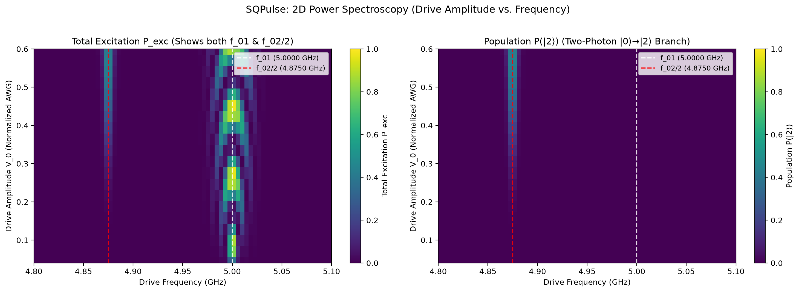
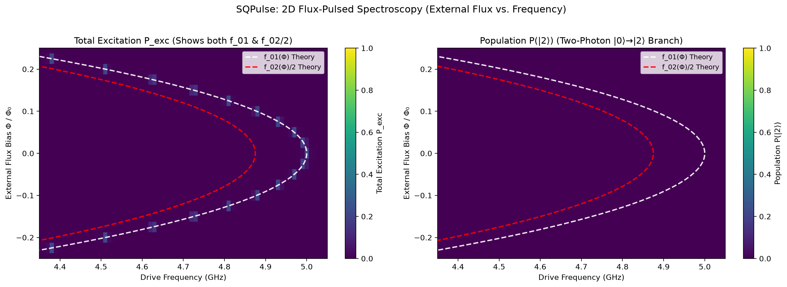

<p align="center">
  
</p>

# SQPulse: 超导量子比特动力学仿真

**SQPulse** 是一个专为超导量子计算（Transmon Qubit）、微波脉冲工程与含时量子动力学模拟而设计的现代 Python 库，提供了直观、模块化和显式调用的 API。

---

## 物理量单位约定 (SI Units)

本项目中所有物理量均严格遵循国际单位制。

> [!TIP]
> **推荐使用内置物理单位常量**：
> SQPulse 提供了清晰易读的单位常量，可直接导入乘用，彻底避免将纳秒误写为秒：
> ```python
> from sqpulse import ns, us, ms, Hz, MHz, GHz, mK
> 
> # 40 ns 脉冲，平顶过渡 8 ns
> p = FlatTopPulse(duration=40 * ns, ramp_time=8 * ns)
> ```

---

## 核心特性

1. **丰富的脉冲波形与时频域双重视角**：
   - 支持高斯脉冲 (`GaussianPulse`)、升余弦脉冲 (`CosinePulse` / Hann 窗)、柯西-洛伦兹脉冲 (`LorentzianPulse`)、理想方波 (`SquarePulse`)、平顶平滑脉冲 (`FlatTopPulse`)、双曲正割脉冲 (`SechPulse`)、DRAG 导数修正脉冲 (`DRAGPulse`) 及任意自定义波形 (`CustomPulse`)。
   - 提供同名小写函数式快捷工厂（如 `gaussian_pulse(...)`, `flattop_pulse(...)`），并支持 `length` 作为 `duration` 的参数别名。
   - 内置智能自适应高分辨率采样，一键式时频双域可视化 (`pulse.plot(domain="both")`)，轻松分析脉冲频谱、半高全宽（FWHM）、谱泄露（Spectral Leakage）与旁瓣衰减。
   - 内置严格的物理量纲与采样步长防错校验，拦截常见的采样步长/参数时间尺度混淆并给出智能修复建议。

2. **严谨的受驱动 Transmon 物理模型**：
   - 支持多能级截断 ($d \ge 2$)，准确刻画更高能级态 $|2\rangle$ 的弱跃迁与泄露。
   - 包含量子频率 $f_q$、非谐性 $\alpha$、微波驱动正交算符 $H_x, H_y$。
   - 内置包含能量弛豫 $T_1$、纯退相位 $T_\phi$（根据 $T_2$ 换算）与热激发 $n_{\text{th}}$ 的完整 Lindblad 耗散主方程。

3. **显式的时间轴脉冲编排调度器 (`PulseSequence`)**：
   - 无隐式全局副作用，通过链式或方法调用清晰添加脉冲 (`add`)、插入延时 (`delay`) 与多通道时钟同步 (`sync`)。
   - 一键绘制多通道时序图 (`seq.plot()`)，并可直接编译为 QuTiP 5 的 `QobjEvo` 含时哈密顿量。

4. **统一测量与动力学主方程演化 (`Measurement`)**：
   - 统一入口调度多种测量与物理仿真后端（理想投影演化 `projective` 或微波色散腔读出 `dispersive`）。
   - 基于现代 QuTiP 5 求解器快速求解含时密度矩阵或纯态演化。
   - 提供各能级粒子数布居随时间演化曲线 (`plot_populations`)、Bloch 坐标曲线 (`plot_bloch_vector`) 及 3D Bloch 球轨迹投影 (`plot_bloch_sphere`)。

5. **标准化经典量子实验协议 (`experiments`)**：
   - **Amplitude / Time Rabi**：自动扫描驱动幅度（$\text{rad/s}$），通过正弦拟合标定 $\pi$ 脉冲与 $\pi/2$ 脉冲。
   - **$T_1$ 弛豫测量**：施加 $\pi$ 脉冲后扫描延时，通过指数衰减拟合提取 $T_1$ 寿命。
   - **Ramsey 干涉测量**：$\pi/2 - \tau - \pi/2$ 干涉序列，通过阻尼正弦拟合提取 $T_2^*$ 及微波失谐量 $\Delta$。
   - **Qubit / Power 频谱测量**：扫描微波驱动频率自动探测单光子与双光子激发谱，精确提取 $f_{01}$、非谐性 $\alpha$ 与两能级粒子数响应。

---

## 核心组件结构

SQPulse 采用高度模块化的分层架构，各核心组件分工明确，协同构成完整的量子脉冲设计、时序编排、系统建模与实验标定流程：

1. **`models`（量子比特与器件模型）**：
   - **定义量子比特模型**：提供受驱动多能级超导量子比特 `Transmon`（支持单结与 SQUID 磁通可调、截断能级 $d$、微波及磁通控制引线与 Lindblad 耗散主方程）以及用于色散读出的微波腔模型 `ReadoutResonator`。
2. **`pulses`（脉冲波形与时频分析）**：
   - **定义各种波形形状**：内置丰富的高保真波形（包括 `GaussianPulse`, `CosinePulse`, `FlatTopPulse`, `DRAGPulse`, `LorentzianPulse`, `SquarePulse`, `SechPulse` 等），支持任意自定义波形 (`CustomPulse`)、智能自适应采样、快速傅里叶变换（FFT）及频域谱泄露分析。
3. **`sequence`（多通道脉冲时序编排）**：
   - **负责波形的编排与调度**：通过 `PulseSequence` 与 `Channel` 统一编排多条物理引线（如 XY 驱动线 `q.xy`、Z 偏置线 `q.z`、RO 读出线 `q.ro`），支持时间对齐与延时插入 (`add`, `delay`, `sync`, `align_center`, `align`)，并可无缝编译为含时哈密顿量。
4. **`measurement`（测量后端与观测方式）**：
   - **定义测量的后端和方式**：提供统一的 `Measurement.run` 入口，支持两种物理精度的测量后端——高精度数值求解主方程态演化的投影后端（`ProjectiveBackend`，默认 `backend="projective"`），以及贴近实际测控硬件、模拟谐振腔传输谱、Langevin 腔光子建立与衰减、数字 IQ 解调与单次聚类判决的色散读出后端（`DispersiveReadoutBackend`）。
5. **`experiments`（常用量子测量实验）**：
   - **定义常用的测量实验**：封装标准化的经典量子测控协议与自动化曲线拟合工具，内置 Rabi 振荡实验 (`RabiExperiment`)、$T_1$ 弛豫测量 (`T1Experiment`)、Ramsey 干涉实验 (`RamseyExperiment`) 以及 Qubit 能谱扫描 (`Spectroscopy`) 等。

---

## Transmon 物理建模与数学公式

SQPulse 中的 `Transmon` 模型以经典 circuit QED 为基础，严格采用国际单位制（SI units）。其完整物理模型与计算公式如下：

### 1. 静态哈密顿量（旋转坐标系）

在载波参考频率为 $f_d$（$\text{Hz}$）的旋转坐标系下，经过旋转波近似（RWA）后，多能级 Transmon 的静态哈密顿量为 Duffing / Kerr 非线性模型：

$$H_0 = 2\pi (f_q - f_d) a^\dagger a + \pi \alpha a^{\dagger 2} a^2 \quad (\text{rad/s})$$

* $f_q$：Qubit $0 \leftrightarrow 1$ 跃迁频率（单位：$\text{Hz}$，例如 $5.0 \times 10^9\text{ Hz}$）。
* $\Delta = f_q - f_d$：驱动失谐量（单位：$\text{Hz}$）。在共振驱动参考系下（默认 $f_d = f_q$），失谐项为零。
* $\alpha$：非谐性（Anharmonicity，单位：$\text{Hz}$，通常为负值，如 $-250 \times 10^6\text{ Hz}$）。
* $a, a^\dagger$：湮灭算符与产生算符，维度由截断能级 `levels` 决定（默认 `levels=4`）。
* 对 Fock 态 $|n\rangle$，本征能量为：$E_n = 2\pi (f_q - f_d) n + \pi \alpha n(n-1)$。由此可知相邻能级跃迁频率差为：
  * $\omega_{01} = 2\pi (f_q - f_d)$
  * $\omega_{12} = \omega_{01} + 2\pi \alpha$（两能级差相差 $2\pi \alpha$）。

### 2. SQUID 磁通调频与引线体系（Flux Tuning & Control Lines）

SQPulse 的 `Transmon` 统一兼容单结与对称/非对称 SQUID 模型。通过结不对称度参数 $d \in [0.0, 1.0]$（默认 $d=1.0$ 为单结）：
$$E_J(\Phi) = E_{J,\Sigma} \sqrt{\cos^2\left(\pi \frac{\Phi}{\Phi_0}\right) + d^2 \sin^2\left(\pi \frac{\Phi}{\Phi_0}\right)}$$
$$f_q(\Phi) = (f_q + |\alpha|) \left[ \cos^2\left(\pi \frac{\Phi}{\Phi_0}\right) + d^2 \sin^2\left(\pi \frac{\Phi}{\Phi_0}\right) \right]^{1/4} - |\alpha|$$

* $d = 1.0$ 时，$\cos^2 + \sin^2 = 1$，$f_q(\Phi) \equiv f_q$ 恒定不变，退化为单结 Transmon；
* $d < 1.0$ 时，可通过外加磁通 $\Phi/\Phi_0$ 动态调谐比特频率。

每个 Transmon 对象提供三条专职物理引线（Channel）：
* **`q.xy`**：电容耦合线，注入微波正交脉冲 $I(t), Q(t)$，驱动 Bloch 球水平轴旋转。
* **`q.z`**：互感耦合线，注入纳秒级基带磁通偏置脉冲，动态改变跃迁频率 $f_q(t)$。支持通过 `v_phi0`（$V_{\Phi_0}$，单位 $\text{V}/\Phi_0$）将 AWG 输出物理电压自动折算为超导环净磁通 $\Phi/\Phi_0 = V / V_{\Phi_0}$。
* **`q.ro`**：读出微波馈线，连接微波谐振腔（Readout Resonator）。

### 3. 微波驱动哈密顿量（RWA 下）

微波驱动信号由 AWG 产生的同相基带包络 $I(t)$ 和正交基带包络 $Q(t)$ 调制，在旋转坐标系下的含时驱动哈密顿量为：

$$H_d(t) = \frac{1}{2} \Omega_d \Big[ I(t) (a + a^\dagger) + Q(t) i(a^\dagger - a) \Big] = I(t) H_{\text{drive},x} + Q(t) H_{\text{drive},y} \quad (\text{rad/s})$$

其中：
* $H_{\text{drive},x} = \frac{1}{2} \Omega_d (a + a^\dagger)$：对应 Bloch 球上的绕 $X$ 轴驱动算符。
* $H_{\text{drive},y} = \frac{1}{2} \Omega_d i(a^\dagger - a)$：对应 Bloch 球上的绕 $Y$ 轴驱动算符。
* $\Omega_d$ (`omega_d`)：物理驱动耦合强度（单位：$\text{rad/s}$，默认 $2\pi \times 50\text{ MHz} \approx 3.14 \times 10^8\text{ rad/s}$）。
* $I(t), Q(t)$：脉冲序列输出的归一化 AWG 电压信号（无量纲，标称范围 $[-1, 1]$）。

系统总哈密顿量即为：
$$H(t) = H_0(t) + I(t) H_{\text{drive},x} + Q(t) H_{\text{drive},y}$$

### 4. 谐振腔色散读出物理原理 (`ReadoutResonator` & `DispersiveReadoutBackend`)

在电路 QED 色散区（$|\Delta_{qr}| \gg g$），微波谐振腔频率随 Transmon 状态产生色散频移 $\chi$：
$$f_r^{(0)} = f_r - \chi / (2\pi), \quad f_r^{(1)} = f_r + \chi / (2\pi)$$

1. **稳态透射谱 ($S_{21}$)**：
   $$S_{21}(f; |n\rangle) = \frac{\kappa_{\text{ext}}}{i 2\pi (f - f_r^{(n)}) + \kappa / 2}$$
2. **含时光子建立与衰减（Langevin 方程）**：
   $$\frac{d\alpha_n(t)}{dt} = - \left[ i 2\pi (f_{\text{ro}} - f_r^{(n)}) + \frac{\kappa}{2} \right] \alpha_n(t) - i \epsilon_{\text{scale}} \epsilon(t)$$
3. **数字解调与单次判决（IQ 复平面）**：
   $$S = I + i Q = \frac{1}{T_{\text{meas}}} \int_0^{T_{\text{meas}}} \sqrt{\kappa_{\text{ext}}} \alpha(t) dt + \xi_{\text{noise}}$$
   通过 `IQDiscriminator` 线性阈值判决，输出真实的混淆矩阵与读出保真度 $\mathcal{F}_{\text{ro}} = \frac{P(0|0) + P(1|1)}{2}$。

### 5. 电路物理参数推导驱动与磁通耦合强度 (`Transmon.from_circuit`)

在超导量子芯片中，微波驱动耦合强度 $\Omega_d$ 和 Z 线磁通周期电压 $V_{\Phi_0}$ 均可由芯片版图电容/互感参数、微波线路衰减及 AWG 输出电压直接解析推导（参考 Krantz et al., 2019）：

#### A. XY 微波电容驱动耦合率 ($\Omega_d$)
1. **总有效电容**：
   $$C_\Sigma = C_g + C_d$$
   （$C_g$ 为对地并联电容，$C_d$ 为微波驱动线对量子比特的耦合电容）
2. **零点电荷涨落（Zero-point charge fluctuation）**：
   $$Q_{\text{zpf}} = \sqrt{\frac{\hbar \omega_q C_\Sigma}{2}}, \quad \omega_q = 2\pi f_q$$
3. **芯片端单位驱动电压耦合率（On-chip coupling rate）**：
   $$\Omega_{\text{chip}} = \frac{C_d}{C_\Sigma} \frac{Q_{\text{zpf}}}{\hbar} \quad \left[\frac{\text{rad}}{\text{s}\cdot\text{V}}\right]$$
4. **微波线路总衰减因子**：
   $$\alpha_{\text{line}} = 10^{\text{attenuation\_dB} / 20}$$
5. **有效物理驱动耦合强度**：
   $$\Omega_d = \Omega_{\text{chip}} \cdot \alpha_{\text{line}} \cdot V_{\text{max}} \quad (\text{rad/s})$$

#### B. Z 偏置线互感与磁通周期电压 ($V_{\Phi_0}$)
对于 Z 偏置线与 SQUID 超导环的几何互感耦合：
1. **Z 偏置线路衰减**：
   $$\alpha_{\text{line}, z} = 10^{\text{attenuation\_z\_dB} / 20}$$
2. **芯片短路端动态电流**：
   $$I_{\text{chip}} = \frac{V_{\text{AWG}} \cdot \alpha_{\text{line}, z}}{Z_0} \quad (Z_0 = 50\,\Omega)$$
3. **SQUID 环感应磁通**：
   $$\Phi = M \cdot I_{\text{chip}} = \frac{M \cdot \alpha_{\text{line}, z}}{Z_0} V_{\text{AWG}}$$
4. **有效磁通周期电压（Flux Period Voltage）**：
   $$V_{\Phi_0} = \frac{\Phi_0 Z_0}{M \cdot \alpha_{\text{line}, z}} \quad [\mathrm{V}/\Phi_0]$$
   （其中 $\Phi_0 = h / (2e) \approx 2.0678 \times 10^{-15}\ \mathrm{Wb}$，使穿过 SQUID 环净磁通改变 $1.0\,\Phi_0$ 所需的 AWG 输出峰值电压）

### 6. 开放系统 Lindblad 耗散主方程

考虑退相干效应时，系统密度矩阵 $\rho(t)$ 的动力学演化满足 Lindblad 主方程：

$$\frac{d\rho}{dt} = -i [H(t), \rho] + \sum_k \mathcal{D}[L_k]\rho$$

其中 Lindblad 超算符定义为：
$$\mathcal{D}[L]\rho = L \rho L^\dagger - \frac{1}{2} \big\{ L^\dagger L, \rho \big\}$$

模型包含的三个主要耗散通道及其坍缩算符（Collapse Operators）$L_k$：
* **能量弛豫（$T_1$ 衰减）**：
  $$L_{\text{down}} = \sqrt{\frac{1 + n_{\text{th}}}{T_1}} a$$
* **热平衡激发（$n_{\text{th}}$）与等效热浴温度（$T$）**：
  在绝对温度 $T$（$\text{Kelvin}$）的热浴环境下，玻色-爱因斯坦统计分布决定激发态热占有率：
  $$n_{\text{th}}(f_q, T) = \frac{1}{\exp\left(\frac{h f_q}{k_B T}\right) - 1}$$
  SQPulse 支持直接传入等效温度（如 `temperature=35 * mK` 或 `"35 mK"`），模型将根据比特共振频率 $f_q$ 自动换算 $n_{\text{th}}$，对应的热激发坍缩算符为：
  $$L_{\text{up}} = \sqrt{\frac{n_{\text{th}}}{T_1}} a^\dagger$$
* **纯退相位（Pure Dephasing，$T_\phi$）**：
  根据横向弛豫时间 $T_2$ 满足的物理关系 $\frac{1}{T_2} = \frac{1}{2 T_1} + \frac{1}{T_\phi}$，换算得到纯退相位速率：
  $$\Gamma_\phi = \frac{1}{T_2} - \frac{1}{2 T_1}$$
  纯退相位坍缩算符为：
  $$L_\phi = \sqrt{2 \Gamma_\phi} a^\dagger a = \sqrt{2 \left(\frac{1}{T_2} - \frac{1}{2 T_1}\right)} \hat{n}$$

---

## 快速上手

### 1. 查看脉冲时域与频域特征

```python
import matplotlib.pyplot as plt
from sqpulse import GaussianPulse, CosinePulse, SquarePulse, FlatTopPulse, DRAGPulse, compare_pulses, ns, MHz

# 定义一个 40 ns 的高斯脉冲 (支持 40e-9 或 40 * ns，支持 length 或 duration)
p_gauss = GaussianPulse(duration=40 * ns, amp=1.0, chop=4.0)

# 定义一个平顶脉冲 (40 ns 总时长，8 ns 平滑过渡边沿)
p_flattop = FlatTopPulse(duration=40 * ns, ramp_time=8 * ns, ramp_type="cosine")

# 定义带有无量纲 DRAG 修正的脉冲 (drag=1.0 为理论最优一阶修正)
p_drag = DRAGPulse(duration=20 * ns, amp=1.0, drag=1.0)

# 一键展示时域波形与频域 FFT 功率谱（无需手动计算 dt，内置自适应高分辨率采样）
p_drag.plot(domain="both")
plt.show()

# 对比多种波形的抗高频谱泄露性能 (cutoff = 100 MHz = 100 * MHz)
p_cos = CosinePulse(duration=40 * ns, amp=1.0)
p_sq = SquarePulse(duration=40 * ns, amp=1.0)
compare_pulses([p_gauss, p_cos, p_sq], domain="both")
plt.show()
```

### 2. 定义受驱动 Transmon 并编排多通道脉冲序列

```python
import matplotlib.pyplot as plt
from sqpulse import Transmon, ReadoutResonator, PulseSequence, GaussianPulse, FlatTopPulse, Measurement, ns, us, MHz, GHz, mK

# 1. 定义通用 Transmon (支持结不对称度 d; d=1.0 为单结, d=0.2 为可调 SQUID, 支持直观等效温度 temperature)
q = Transmon("q0", f_q=5.0 * GHz, alpha=-250.0 * MHz, d=0.2, levels=3, t1=25.0 * us, t2=18.0 * us, temperature=35 * mK)

# 2. 编排多通道脉冲序列 (包含 XY 驱动、Z 磁通调频与腔读出)
seq = PulseSequence(name="control_and_readout")
# (1) 在 xy (XY) 施加 pi/2 脉冲
seq.add(q.xy, GaussianPulse(duration=30 * ns, amp=0.5))
seq.sync()

# (2) 在 z (Z) 施加快速磁通脉冲调制频率
seq.add(q.z, FlatTopPulse(duration=40 * ns, amp=0.1, ramp_time=4 * ns))
seq.sync()

# (3) 施加第二个 pi/2 脉冲
seq.add(q.xy, GaussianPulse(duration=30 * ns, amp=0.5))
seq.sync()

# (4) 在 ro (RO) 施加 1 us 微波读出脉冲
seq.add(q.ro, FlatTopPulse(duration=1000 * ns, amp=1.0, ramp_time=20 * ns))

# 绘制多通道时间轴对齐图
seq.plot()
plt.show()

# 3. 双后端测量选择
# 方式 A：选择理想投影与态演化后端 (精确主方程求解)
res_proj = Measurement.run(q, seq, backend="projective")
res_proj.plot_populations()
plt.show()

# 方式 B：选择真实色散谐振腔读出后端 (微波传输谱、IQ 解调与单次判决)
cavity = ReadoutResonator(name="r0", f_r=7.0 * GHz, kappa=3.0 * MHz, chi=1.5 * MHz)
res_disp = Measurement.run(q, seq, backend="dispersive", resonator=cavity, shots=1000, snr_db=15.0)
res_disp.plot_iq_plane()     # 查看 IQ 平面聚类散点图与判决面
res_disp.plot_trajectories() # 查看腔内光子动力学建立与衰减
plt.show()
print(f"读出保真度: {res_disp.fidelity:.2%}")
print("混淆矩阵:\n", res_disp.confusion_matrix)
```

### 3. 从 JSON 配置文件快速加载与导出模型 (配置驱动)

SQPulse 支持使用 JSON 文件统一声明芯片上的量子比特与读出腔参数（支持纯数字或 `"5.0 GHz"`、`"25.0 us"` 等人类可读物理量单位字符串），实现硬件标定参数与实验逻辑代码彻底解耦：

```json
{
  "transmons": {
    "q0": {
      "f_q": "5.0 GHz",
      "alpha": "-250.0 MHz",
      "d": 0.25,
      "levels": 3,
      "t1": "30.0 us",
      "t2": "22.0 us",
      "temperature": "35 mK",
      "v_phi0": "0.85 V"
    }
  },
  "resonators": {
    "r0": {
      "f_r": "7.05 GHz",
      "kappa": "2.8 MHz",
      "chi": "1.3 MHz"
    }
  }
}
```

```python
from sqpulse import load_models, save_models, Transmon

# 1. 一键加载整颗芯片的所有组件模型
models = load_models("examples/chip_config.json")
q0 = models["q0"] # 支持字典式访问或 models.transmons["q0"]
r0 = models["r0"] # 访问对应谐振腔 models.resonators["r0"]

# 2. 也可以单独加载单组件配置
# q0 = Transmon.from_json("q0.json")

# 3. 实验标定后可随时导出为字典或写回 JSON 文件
q0.t1 = 35.0e-6
save_models(models, "calibrated_chip.json", human_readable=True)
```

### 4. 运行量子实验测量

```python
import matplotlib.pyplot as plt
from sqpulse import Transmon, GaussianPulse, RabiExperiment, T1Experiment, RamseyExperiment

q = Transmon("q0", f_q=5.0e9, alpha=-250.0e6, t1=20.0e-6, t2=15.0e-6)

# 4.1 振幅 Rabi 标定 pi 脉冲 AWG 输出幅度 V_0
rabi_res = RabiExperiment.amplitude_rabi(q, pulse_type=GaussianPulse, duration=40e-9)
print(f"标定得到的 pi 脉冲幅度 V_0: {rabi_res.amp_pi:.3f}")
rabi_res.plot()
plt.show()

# 4.2 T1 弛豫测量
pi_pulse = GaussianPulse(duration=40e-9, amp=rabi_res.amp_pi)
t1_res = T1Experiment.run(q, pi_pulse=pi_pulse)
print(f"拟合得到的 T1 寿命: {t1_res.t1_fit:.2e} s")
t1_res.plot()
plt.show()

# 4.3 Ramsey 干涉实验 (失谐 detuning = 2 MHz = 2e6 Hz)
pi2_pulse = GaussianPulse(duration=40e-9, amp=rabi_res.amp_pi_half)
ramsey_res = RamseyExperiment.run(q, pi_half_pulse=pi2_pulse, detuning=2.0e6)
print(f"拟合测得 T2*: {ramsey_res.t2_star:.2e} s, 失谐: {ramsey_res.fitted_detuning:.2e} Hz")
ramsey_res.plot()
plt.show()

# 4.4 1D 量子比特频率能谱扫描 (Qubit Spectroscopy)
from sqpulse import Spectroscopy, SquarePulse

freqs_1d = np.linspace(4.8e9, 5.15e9, 71)
exp_1d = Spectroscopy.set(
    transmon=q,
    freqs=freqs_1d,
    amps=0.08,
    pulse_type=SquarePulse,
    duration=200e-9,
    fit=True,
)
res_1d = exp_1d.run()
print(f"拟合得到的 f_01 共振频率: {res_1d.f01 / 1e9:.4f} GHz")
res_1d.plot()
plt.show()
```

### 5. 2D 多维量子能谱实验 (2D Multi-parameter Spectroscopy)

SQPulse 的 `Spectroscopy` 采用现代两阶段工作流（`set()` 配置并查看波形 -> `run()` 求解）。无需切换不同方法或在外部创建脉冲对象，当向二次物理量参数（如 `amps` 或 `flux`）传入一维数组时，实验方法自动升维识别为 2D 联合扫描，支持在运行前调用 `exp.plot_sequence()` 直观查看带物理量扫描范围指示箭头的多通道波形时序，其结果对象 `res.plot()` 亦会自动适配该物理量进行专业绘图与物理理论线叠加。

#### 5.1 2D 功率能谱扫描 (Power Spectroscopy: 微波驱动幅度 vs. 频率)

在超导量子比特测量中，随着微波驱动功率提升，基频共振跃迁会出现功率展宽（Power Broadening）；当驱动较强时，双光子跃迁支线 $|0\rangle \to |2\rangle$（位于 $f_{01} + \alpha/2$）将被显著激发。

向 `amps` 传入幅度数组即可一键启动 2D 功率能谱扫描：

```python
import numpy as np
import matplotlib.pyplot as plt
from sqpulse import Transmon, Spectroscopy, FlatTopPulse, GHz, MHz, ns

# 1. 定义 Transmon (levels=4 可观测双光子跃迁)
q = Transmon("q0", f_q=5.0 * GHz, alpha=-250.0 * MHz, omega_d=50 * MHz, levels=4)

# 2. 2D 功率能谱配置：amps 传入数组，系统自动识别为 2D 功率能谱
freqs_2d = np.linspace(4.8 * GHz, 5.1 * GHz, 71)
amps_2d = np.linspace(0.04, 0.6, 20)

exp_pwr = Spectroscopy.set(
    transmon=q,
    freqs=freqs_2d,
    amps=amps_2d,
    pulse_type=FlatTopPulse,
    duration=150 * ns,
)

# 3. 运行前波形序列可视化：展示驱动幅度扫描范围与脉冲时序
exp_pwr.plot_sequence()
plt.show()

# 4. 正式执行实验模拟求解
pwr_res = exp_pwr.run()

# 5. 物理量自适应绘图：自动设置 Y 轴为驱动幅度，并排展示总激发态与双光子支线 (|0> -> |2>)
pwr_res.plot(observable="both")
plt.show()
```

<p align="center">
  
</p>

#### 5.2 2D 磁通能谱扫描 (Flux-Pulsed Spectroscopy: 外部磁通偏置 vs. 频率)

在**磁通可调 Transmon（SQUID Transmon）** 实验中，能级跃迁频率随穿过超导环的磁通量 $\Phi$ 呈周期性变化。实验中通常在 **Z 偏置线 (`q.z`)** 施加纳秒级平顶磁通脉冲调制工作点，并在其平顶期间于 **XY 控制线 (`q.xy`)** 同步施加微波弱探测脉冲。

向 `flux` 传入磁通数组时，`Spectroscopy` 内部固化了该时序逻辑：
* 在 `transmon.z` 上自动施加时长比 XY 脉冲长 100 ns 的平顶磁通脉冲。
* **Z 脉冲与 XY 探测脉冲严格中心对齐**（确保探测全程处于平顶稳定区间）。
* 运行前 `exp.plot_sequence()` 直观展示 Z 偏置范围与 XY 探测中心对齐的时序图。
* 结果对象 `.plot()` 会在二维色图上**自动叠加理论 SQUID 调谐拱形曲线** $f_{01}(\Phi)$ 与 $f_{02}(\Phi)/2$。

```python
import numpy as np
import matplotlib.pyplot as plt
from sqpulse import Transmon, Spectroscopy, FlatTopPulse, GHz, MHz, ns

# 1. 定义磁通可调 SQUID Transmon (结不对称度 d=0.25 < 1.0)
q_tunable = Transmon("q_flux", f_q=5.0 * GHz, alpha=-250.0 * MHz, d=0.25, levels=3)

# 2. 2D 磁通能谱配置：flux 传入数组，自动施加长 100ns 且中心对齐的 Z 脉冲并联合扫频
freqs_flux = np.linspace(4.35 * GHz, 5.05 * GHz, 71)
flux_vals = np.linspace(-0.25, 0.25, 21)

exp_flux = Spectroscopy.set(
    transmon=q_tunable,
    freqs=freqs_flux,
    amps=0.04,
    flux=flux_vals,
    pulse_type=FlatTopPulse,
    duration=100 * ns,
)

# 3. 运行前波形序列可视化：直观展示 Z 磁通调制范围与 XY 探测脉冲中心对齐
exp_flux.plot_sequence()
plt.show()

# 4. 正式执行实验模拟求解
flux_res = exp_flux.run()

# 5. 物理量自适应绘图：自动识别外部磁通，并在热力图上直接叠加理论调谐拱形曲线 f01(Φ) 与 f02(Φ)/2
flux_res.plot(observable="both")
plt.show()
```

<p align="center">
  
</p>


---

## 运行测试

使用 `pytest` 运行单元测试套件：

```bash
uv run pytest
```
